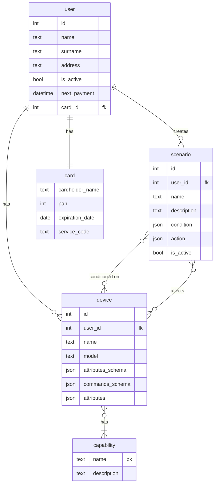

# Project_template

Это шаблон для решения проектной работы. Структура этого файла повторяет структуру заданий. Заполняйте его по мере работы над решением.

# Задание 1. Анализ и планирование

### 1. Описание функциональности монолитного приложения

**Управление отоплением:**

- Пользователи могут управлять температурой котла и тёплого пола, уменьшая/увеличивая температуру в доме (_не отражено в коде_).
- Система поддерживает подключение отопительных котлов с удалённым управлением и контроллеров Tech Controllers для управления тёплым полом.

**Мониторинг температуры:**

- Пользователи могут получать актуальные данные о температуре с сенсоров, расположенных в разных комнатах.
- Система поддерживает только один сенсор на комнату
- Каждый запрос пользователя о получении температуры обрабатывается синхронно (приводит к опросу сенсора)
- Система поддерживает добавление/удаление/обновление информации о расположении сенсора через HTTP API (REST)

### 2. Анализ архитектуры монолитного приложения

Стек: Go 1.22, Gin 1.8, PosgreSQL 16

### 3. Определение доменов и границы контекстов

1. Домен определения температуры

- Entities: Sensor
- Value Objects: TemperatureResponse
- Repositories: SensorRepo
- Services: GetTemperatureByID, GetTemperature

2. Домен управления нагревателями

- Entities: Boiler, HeatedFloor
- Value Objects: BoilerState, HeatedFloorState,
- Repositories: BoilerRepo, HeatedFloorRepo
- Services: GetBoilerState, GetHeatedFloorState, SetBoilerTemperature, SetHeatedFloorTemperature

### **4. Проблемы монолитного решения**

**Критические дефекты**

- Отсутствие привязки сенсора к пользователю.  
  В объектной модели сенсора нет указателя на пользователя, к которому он относится -> можно получать информацию с сенсоров других пользователей (например, чтобы понять, дома они или нет).
- Отсутствует авторизация: если у пользователя есть доступ к API приложения и возможность выполнить запрос GET /api/v1/sensors, ничего не мешает ему выполнить DELETE /api/v1/sensors/:id. В сочетани с предыдущим пунктом это даёт возможность вывести из строя всю систему для всех пользователей.

**Функциональные проблемы**

- отсутствие возможности подключения сенсоров/управляющих элементов помимо сенсоров/управляющих элементов связанных с температурой.
  Хотелось бы иметь возможность подключать также ip-камеры, сигнализации, умные розетки, умное управление светом, кондиционерами и т.д.

**Не функциональные проблемы**

- Большое время отклика
  Т.к. каждый запрос пользователя для получения температуры выполняется синхронно, время ответа может непредсказуемо меняться в зависимости от времени ответа датчика.
- Большая нагрузка на сервер либо неактуальные данные
  Если пользователь держит приложение открытым, то приложение либо периодически опрашивает сервер (и каждый запрос приводит к опросу датчика), либо показывает неактуальные данные, пока пользователь явно не нажмёт кнопку (что неудобно)

### 5. Визуализация контекста системы — диаграмма С4

[System Context](diagrams/as-is/Contex.svg)
[Container](diagrams/as-is/Container.svg)

# Задание 2. Проектирование микросервисной архитектуры

В этом задании вам нужно предоставить только диаграммы в модели C4. Мы не просим вас отдельно описывать получившиеся микросервисы и то, как вы определили взаимодействия между компонентами To-Be системы. Если вы правильно подготовите диаграммы C4, они и так это покажут.


# Задание 3. Разработка ER-диаграммы



# Задание 4. Создание и документирование API

### 1. Тип API

#### User API

Для взаимодействия с мобильным приложением я использую 3 различных вида API:

- Async GraphQL для получения информации о датчиках/устройствах, их возможностях и текущем состоянии, а также для изменении их состояния (для команд)
- REST API для редактирования профиля и создания сценариев
- Простое AsyncAPI/websocket для отправки информации с датчиков в режиме реального времени

**Async GraphQL**

### 2. Документация API

Здесь приложите ссылки на документацию API для микросервисов, которые вы спроектировали в первой части проектной работы. Для документирования используйте Swagger/OpenAPI или AsyncAPI.

# Задание 5. Работа с docker и docker-compose

Перейдите в apps.

Там находится приложение-монолит для работы с датчиками температуры. В README.md описано как запустить решение.

Вам нужно:

1. сделать простое приложение temperature-api на любом удобном для вас языке программирования, которое при запросе /temperature?location= будет отдавать рандомное значение температуры.

Locations - название комнаты, sensorId - идентификатор названия комнаты

```
	// If no location is provided, use a default based on sensor ID
	if location == "" {
		switch sensorID {
		case "1":
			location = "Living Room"
		case "2":
			location = "Bedroom"
		case "3":
			location = "Kitchen"
		default:
			location = "Unknown"
		}
	}

	// If no sensor ID is provided, generate one based on location
	if sensorID == "" {
		switch location {
		case "Living Room":
			sensorID = "1"
		case "Bedroom":
			sensorID = "2"
		case "Kitchen":
			sensorID = "3"
		default:
			sensorID = "0"
		}
	}
```

2. Приложение следует упаковать в Docker и добавить в docker-compose. Порт по умолчанию должен быть 8081

3. Кроме того для smart_home приложения требуется база данных - добавьте в docker-compose файл настройки для запуска postgres с указанием скрипта инициализации ./smart_home/init.sql

Для проверки можно использовать Postman коллекцию smarthome-api.postman_collection.json и вызвать:

- Create Sensor
- Get All Sensors

Должно при каждом вызове отображаться разное значение температуры

Ревьюер будет проверять точно так же.
