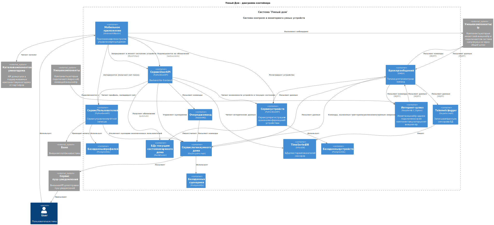
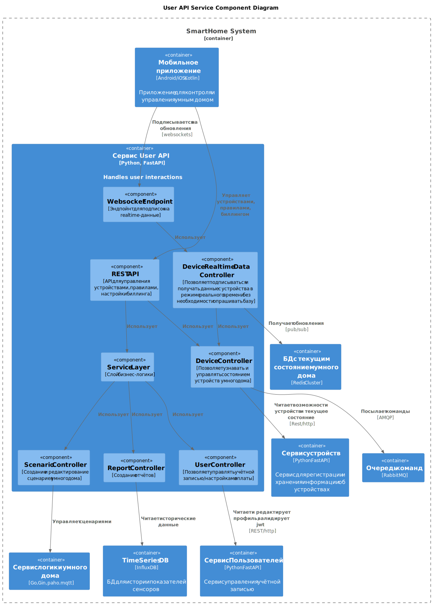

# Project_template

Это шаблон для решения проектной работы. Структура этого файла повторяет структуру заданий. Заполняйте его по мере работы над решением.

# Задание 1. Анализ и планирование

### 1. Описание функциональности монолитного приложения

**Управление отоплением:**

- Пользователи могут управлять температурой котла и тёплого пола, уменьшая/увеличивая температуру в доме (_не отражено в коде_).
- Система поддерживает подключение отопительных котлов с удалённым управлением и контроллеров Tech Controllers для управления тёплым полом.

**Мониторинг температуры:**

- Пользователи могут получать актуальные данные о температуре с сенсоров, расположенных в разных комнатах.
- Система поддерживает только один сенсор на комнату
- Каждый запрос пользователя о получении температуры обрабатывается синхронно (приводит к опросу сенсора)
- Система поддерживает добавление/удаление/обновление информации о расположении сенсора через HTTP API (REST)

### 2. Анализ архитектуры монолитного приложения

Стек: Go 1.22, Gin 1.8, PosgreSQL 16

### 3. Определение доменов и границы контекстов

1. Домен определения температуры

- Entities: Sensor
- Value Objects: TemperatureResponse
- Repositories: SensorRepo
- Services: GetTemperatureByID, GetTemperature

2. Домен управления нагревателями

- Entities: Boiler, HeatedFloor
- Value Objects: BoilerState, HeatedFloorState,
- Repositories: BoilerRepo, HeatedFloorRepo
- Services: GetBoilerState, GetHeatedFloorState, SetBoilerTemperature, SetHeatedFloorTemperature

### **4. Проблемы монолитного решения**

**Критические дефекты**

- Отсутствие привязки сенсора к пользователю.  
  В объектной модели сенсора нет указателя на пользователя, к которому он относится -> можно получать информацию с сенсоров других пользователей (например, чтобы понять, дома они или нет).
- Отсутствует авторизация: если у пользователя есть доступ к API приложения и возможность выполнить запрос GET /api/v1/sensors, ничего не мешает ему выполнить DELETE /api/v1/sensors/:id. В сочетани с предыдущим пунктом это даёт возможность вывести из строя всю систему для всех пользователей.

**Функциональные проблемы**

- отсутствие возможности подключения сенсоров/управляющих элементов помимо сенсоров/управляющих элементов связанных с температурой.
  Хотелось бы иметь возможность подключать также ip-камеры, сигнализации, умные розетки, умное управление светом, кондиционерами и т.д.

**Не функциональные проблемы**

- Большое время отклика
  Т.к. каждый запрос пользователя для получения температуры выполняется синхронно, время ответа может непредсказуемо меняться в зависимости от времени ответа датчика.
- Большая нагрузка на сервер либо неактуальные данные
  Если пользователь держит приложение открытым, то приложение либо периодически опрашивает сервер (и каждый запрос приводит к опросу датчика), либо показывает неактуальные данные, пока пользователь явно не нажмёт кнопку (что неудобно)

### 5. Визуализация контекста системы — диаграмма С4

[System Context](diagrams/as-is/Contex.svg)
[Container](diagrams/as-is/Container.svg)

# Задание 2. Проектирование микросервисной архитектуры

В этом задании вам нужно предоставить только диаграммы в модели C4. Мы не просим вас отдельно описывать получившиеся микросервисы и то, как вы определили взаимодействия между компонентами To-Be системы. Если вы правильно подготовите диаграммы C4, они и так это покажут.





# Задание 3. Разработка ER-диаграммы


# Задание 4. Создание и документирование API

### 1. Тип API

Для взаимодействия с мобильным приложением я использую 2 вида API:
- REST API - управление устройствами и получение их состояния, создание правил и редактирование профиля
- Простое AsyncAPI/websocket для отправки информации с датчиков в режиме реального времени

Я выбрал REST за его простоту (по сравнению с GraphQL). Хотя могут быть случаи, когда пользователю нужно получить не всю информацию
об устройстве, а только часть, это не должно быть проблемой, т.к. число устройств в умном доме вряд ли превысит количество,
после которого разница в количестве возвращаемых полей станет заметной.
Помимо этого при выборе GraphQL пришлось бы всё равно делать отдельное API для команд, поскольку механизм мутаций тут 
не подходит - нельзя однозначно поставить каждой команде в соответствие мутацию состояния устройства (например, как 
представить проигрывание мелодии плеером?).

Для взаимодействия с устройствами умного дома я использую AsyncAPI и MQPP в качестве протокола. MQPP выбран за меньший 
по сравнению с AMQP размер сообщения, что важно при передаче через ненадёжную сеть. Топики содержат только deviceId, а не
userId, чтобы смена владельца устройства не приводила к переименованию топика и чтобы не раскрывать id юзера лишний раз.

### 2. Документация API

#### [User API](https://app.swaggerhub.com/apis/meee-fdc/SmathThings/1.0#/) (Я взял готовое у Самсунга и просто залил на Swagger Hub)
#### [User API (RealTime Data)](https://studio.asyncapi.com/#channels-deviceCommands)
#### [Device API](https://studio.asyncapi.com/?base64=YXN5bmNhcGk6IDMuMC4wCmluZm86CiAgdGl0bGU6IFNtYXJ0IEhvbWUgRGV2aWNlIE1lc3NhZ2luZyAoRGV2aWNlIHBlcnNwZWN0aXZlKQogIHZlcnNpb246IDEuMC4xCmRlZmF1bHRDb250ZW50VHlwZTogYXBwbGljYXRpb24vanNvbgoKc2VydmVyczoKICBtcXR0LXByb2Q6CiAgICBob3N0OiBtcXR0LmV4YW1wbGUuY29tOjg4ODMKICAgIHByb3RvY29sOiBtcXR0CiAgICBwcm90b2NvbFZlcnNpb246ICc1JwogICAgZGVzY3JpcHRpb246IFByb2R1Y3Rpb24gTVFUVCBvdmVyIFRMUyB3aXRoIHBlci1kZXZpY2UgY2xpZW50IGNlcnRzIChtVExTKQogICAgc2VjdXJpdHk6CiAgICAgIC0gJHJlZjogJyMvY29tcG9uZW50cy9zZWN1cml0eVNjaGVtZXMvbVRMUycKCmNoYW5uZWxzOgogIGRldmljZUNvbW1hbmRzOgogICAgYWRkcmVzczogZGV2aWNlcy97ZGV2aWNlSWR9L2NvbW1hbmRzCiAgICBzZXJ2ZXJzOiBbIHsgJHJlZjogJyMvc2VydmVycy9tcXR0LXByb2QnIH0gXQogICAgcGFyYW1ldGVyczoKICAgICAgZGV2aWNlSWQ6CiAgICAgICAgJHJlZjogJyMvY29tcG9uZW50cy9wYXJhbWV0ZXJzL2RldmljZUlkJwogICAgbWVzc2FnZXM6CiAgICAgIENvbW1hbmQ6CiAgICAgICAgJHJlZjogJyMvY29tcG9uZW50cy9tZXNzYWdlcy9Db21tYW5kJwogIGRlc2lyZWRTdGF0ZToKICAgIGFkZHJlc3M6IGRldmljZXMve2RldmljZUlkfS9zdGF0ZS9kZXNpcmVkCiAgICBzZXJ2ZXJzOiBbIHsgJHJlZjogJyMvc2VydmVycy9tcXR0LXByb2QnIH0gXQogICAgcGFyYW1ldGVyczoKICAgICAgZGV2aWNlSWQ6CiAgICAgICAgJHJlZjogJyMvY29tcG9uZW50cy9wYXJhbWV0ZXJzL2RldmljZUlkJwogICAgbWVzc2FnZXM6CiAgICAgIERlc2lyZWRTdGF0ZToKICAgICAgICAkcmVmOiAnIy9jb21wb25lbnRzL21lc3NhZ2VzL0Rlc2lyZWRTdGF0ZScKICBjb21tYW5kQWNrczoKICAgIGFkZHJlc3M6IGRldmljZXMve2RldmljZUlkfS9jb21tYW5kLWFja3MKICAgIHNlcnZlcnM6IFsgeyAkcmVmOiAnIy9zZXJ2ZXJzL21xdHQtcHJvZCcgfSBdCiAgICBwYXJhbWV0ZXJzOgogICAgICBkZXZpY2VJZDoKICAgICAgICAkcmVmOiAnIy9jb21wb25lbnRzL3BhcmFtZXRlcnMvZGV2aWNlSWQnCiAgICBtZXNzYWdlczoKICAgICAgQ29tbWFuZEFjazoKICAgICAgICAkcmVmOiAnIy9jb21wb25lbnRzL21lc3NhZ2VzL0NvbW1hbmRBY2snCiAgY29tbWFuZFJlc3VsdHM6CiAgICBhZGRyZXNzOiBkZXZpY2VzL3tkZXZpY2VJZH0vY29tbWFuZC1yZXN1bHRzCiAgICBzZXJ2ZXJzOiBbIHsgJHJlZjogJyMvc2VydmVycy9tcXR0LXByb2QnIH0gXQogICAgcGFyYW1ldGVyczoKICAgICAgZGV2aWNlSWQ6CiAgICAgICAgJHJlZjogJyMvY29tcG9uZW50cy9wYXJhbWV0ZXJzL2RldmljZUlkJwogICAgbWVzc2FnZXM6CiAgICAgIENvbW1hbmRSZXN1bHQ6CiAgICAgICAgJHJlZjogJyMvY29tcG9uZW50cy9tZXNzYWdlcy9Db21tYW5kUmVzdWx0JwogIHJlcG9ydGVkU3RhdGU6CiAgICBhZGRyZXNzOiBkZXZpY2VzL3tkZXZpY2VJZH0vc3RhdGUvcmVwb3J0ZWQKICAgIHNlcnZlcnM6IFsgeyAkcmVmOiAnIy9zZXJ2ZXJzL21xdHQtcHJvZCcgfSBdCiAgICBwYXJhbWV0ZXJzOgogICAgICBkZXZpY2VJZDoKICAgICAgICAkcmVmOiAnIy9jb21wb25lbnRzL3BhcmFtZXRlcnMvZGV2aWNlSWQnCiAgICBtZXNzYWdlczoKICAgICAgUmVwb3J0ZWRTdGF0ZToKICAgICAgICAkcmVmOiAnIy9jb21wb25lbnRzL21lc3NhZ2VzL1JlcG9ydGVkU3RhdGUnCgpvcGVyYXRpb25zOgogIG9wUmVjZWl2ZURldmljZUNvbW1hbmQ6CiAgICBhY3Rpb246IHJlY2VpdmUKICAgIGNoYW5uZWw6IHsgJHJlZjogJyMvY2hhbm5lbHMvZGV2aWNlQ29tbWFuZHMnIH0KICAgIG1lc3NhZ2VzOgogICAgICAtICRyZWY6ICcjL2NoYW5uZWxzL2RldmljZUNvbW1hbmRzL21lc3NhZ2VzL0NvbW1hbmQnCiAgICBiaW5kaW5nczoKICAgICAgbXF0dDogeyBxb3M6IDEsIHJldGFpbjogZmFsc2UgfQoKICBvcFJlY2VpdmVEZXNpcmVkU3RhdGU6CiAgICBhY3Rpb246IHJlY2VpdmUKICAgIGNoYW5uZWw6IHsgJHJlZjogJyMvY2hhbm5lbHMvZGVzaXJlZFN0YXRlJyB9CiAgICBtZXNzYWdlczoKICAgICAgLSAkcmVmOiAnIy9jaGFubmVscy9kZXNpcmVkU3RhdGUvbWVzc2FnZXMvRGVzaXJlZFN0YXRlJwogICAgYmluZGluZ3M6CiAgICAgIG1xdHQ6IHsgcW9zOiAxLCByZXRhaW46IHRydWUgfQoKICBvcFNlbmRBY2s6CiAgICBhY3Rpb246IHNlbmQKICAgIGNoYW5uZWw6IHsgJHJlZjogJyMvY2hhbm5lbHMvY29tbWFuZEFja3MnIH0KICAgIG1lc3NhZ2VzOgogICAgICAtICRyZWY6ICcjL2NoYW5uZWxzL2NvbW1hbmRBY2tzL21lc3NhZ2VzL0NvbW1hbmRBY2snCiAgICBiaW5kaW5nczoKICAgICAgbXF0dDogeyBxb3M6IDEsIHJldGFpbjogZmFsc2UgfQoKICBvcFNlbmRSZXN1bHQ6CiAgICBhY3Rpb246IHNlbmQKICAgIGNoYW5uZWw6IHsgJHJlZjogJyMvY2hhbm5lbHMvY29tbWFuZFJlc3VsdHMnIH0KICAgIG1lc3NhZ2VzOgogICAgICAtICRyZWY6ICcjL2NoYW5uZWxzL2NvbW1hbmRSZXN1bHRzL21lc3NhZ2VzL0NvbW1hbmRSZXN1bHQnCiAgICBiaW5kaW5nczoKICAgICAgbXF0dDogeyBxb3M6IDEsIHJldGFpbjogZmFsc2UgfQoKICBvcFNlbmRSZXBvcnRlZFN0YXRlOgogICAgYWN0aW9uOiBzZW5kCiAgICBjaGFubmVsOiB7ICRyZWY6ICcjL2NoYW5uZWxzL3JlcG9ydGVkU3RhdGUnIH0KICAgIG1lc3NhZ2VzOgogICAgICAtICRyZWY6ICcjL2NoYW5uZWxzL3JlcG9ydGVkU3RhdGUvbWVzc2FnZXMvUmVwb3J0ZWRTdGF0ZScKICAgIGJpbmRpbmdzOgogICAgICBtcXR0OiB7IHFvczogMSwgcmV0YWluOiB0cnVlIH0KCmNvbXBvbmVudHM6CiAgc2VjdXJpdHlTY2hlbWVzOgogICAgbVRMUzoKICAgICAgdHlwZTogWDUwOSAgICMgdmFsaWQgQXN5bmNBUEkgdjMgdHlwZSBmb3IgY2xpZW50IGNlcnQgYXV0aAogICAgICBkZXNjcmlwdGlvbjogTXV0dWFsIFRMUyB1c2luZyBwZXItZGV2aWNlIFguNTA5IGNsaWVudCBjZXJ0aWZpY2F0ZXMuCiAgcGFyYW1ldGVyczoKICAgIGRldmljZUlkOgogICAgICBkZXNjcmlwdGlvbjogSW1tdXRhYmxlIGRldmljZSBpZGVudGlmaWVyIChVVUlEKQogICAgICBleGFtcGxlczogWydlN2Y2YzYzYS02YzlkLTQxZmUtOWQxZC0yYTNlNmY3ZDlhMTAnXQogIGNvcnJlbGF0aW9uSWRzOgogICAgY29tbWFuZENvcnJlbGF0aW9uOgogICAgICBkZXNjcmlwdGlvbjogQ29ycmVsYXRlcyBhY2tzL3Jlc3VsdHMvc3RhdGUgdG8gYSBjb21tYW5kCiAgICAgIGxvY2F0aW9uOiAkbWVzc2FnZS5oZWFkZXIjL2NvbW1hbmRJZAogIG1lc3NhZ2VUcmFpdHM6CiAgICBDb3JyZWxhdGVkOgogICAgICBjb3JyZWxhdGlvbklkOiB7ICRyZWY6ICcjL2NvbXBvbmVudHMvY29ycmVsYXRpb25JZHMvY29tbWFuZENvcnJlbGF0aW9uJyB9CiAgICAgIGhlYWRlcnM6CiAgICAgICAgdHlwZTogb2JqZWN0CiAgICAgICAgcHJvcGVydGllczoKICAgICAgICAgIGNvbW1hbmRJZDogeyB0eXBlOiBzdHJpbmcgfQogICAgICAgICAgdHM6IHsgdHlwZTogc3RyaW5nLCBmb3JtYXQ6IGRhdGUtdGltZSB9CiAgc2NoZW1hczoKICAgIENhcGFiaWxpdHlDb21tYW5kOgogICAgICB0eXBlOiBvYmplY3QKICAgICAgcmVxdWlyZWQ6IFtjYXBhYmlsaXR5LCBjb21tYW5kXQogICAgICBwcm9wZXJ0aWVzOgogICAgICAgIGNhcGFiaWxpdHk6IHsgdHlwZTogc3RyaW5nLCBleGFtcGxlOiBzd2l0Y2ggfQogICAgICAgIGNvbW1hbmQ6IHsgdHlwZTogc3RyaW5nLCBleGFtcGxlOiBvbiB9CiAgICAgICAgYXJnczogeyB0eXBlOiBhcnJheSwgaXRlbXM6IHt9IH0KICAgIENvbW1hbmRQYXlsb2FkOgogICAgICB0eXBlOiBvYmplY3QKICAgICAgcmVxdWlyZWQ6IFtjb21tYW5kSWQsIGNvbW1hbmRzXQogICAgICBwcm9wZXJ0aWVzOgogICAgICAgIGNvbW1hbmRJZDogeyB0eXBlOiBzdHJpbmcgfQogICAgICAgIGNvbW1hbmRzOgogICAgICAgICAgdHlwZTogYXJyYXkKICAgICAgICAgIGl0ZW1zOiB7ICRyZWY6ICcjL2NvbXBvbmVudHMvc2NoZW1hcy9DYXBhYmlsaXR5Q29tbWFuZCcgfQogICAgICAgIGRlc2lyZWRTdGF0ZTogeyAkcmVmOiAnIy9jb21wb25lbnRzL3NjaGVtYXMvU3RhdGVEb2MnIH0KICAgICAgICB0aW1lb3V0TXM6IHsgdHlwZTogaW50ZWdlciwgbWluaW11bTogMTAwMCwgZGVmYXVsdDogNTAwMCB9CiAgICAgICAgbWV0YTogeyB0eXBlOiBvYmplY3QsIGFkZGl0aW9uYWxQcm9wZXJ0aWVzOiB0cnVlIH0KICAgIEFja1BheWxvYWQ6CiAgICAgIHR5cGU6IG9iamVjdAogICAgICByZXF1aXJlZDogW2NvbW1hbmRJZCwgc3RhdHVzXQogICAgICBwcm9wZXJ0aWVzOgogICAgICAgIGNvbW1hbmRJZDogeyB0eXBlOiBzdHJpbmcgfQogICAgICAgIHN0YXR1czogeyB0eXBlOiBzdHJpbmcsIGVudW06IFthY2NlcHRlZCwgcmVqZWN0ZWRdIH0KICAgICAgICByZWFzb246IHsgdHlwZTogc3RyaW5nIH0KICAgIFJlc3VsdFBheWxvYWQ6CiAgICAgIHR5cGU6IG9iamVjdAogICAgICByZXF1aXJlZDogW2NvbW1hbmRJZCwgc3RhdHVzXQogICAgICBwcm9wZXJ0aWVzOgogICAgICAgIGNvbW1hbmRJZDogeyB0eXBlOiBzdHJpbmcgfQogICAgICAgIHN0YXR1czogeyB0eXBlOiBzdHJpbmcsIGVudW06IFtjb21wbGV0ZWQsIGZhaWxlZCwgdGltZW91dF0gfQogICAgICAgIGRldGFpbDogeyB0eXBlOiBzdHJpbmcgfQogICAgICAgIHByb2dyZXNzOiB7IHR5cGU6IG51bWJlciwgbWluaW11bTogMCwgbWF4aW11bTogMTAwIH0KICAgIFN0YXRlRG9jOgogICAgICB0eXBlOiBvYmplY3QKICAgICAgcHJvcGVydGllczoKICAgICAgICB2ZXJzaW9uOiB7IHR5cGU6IGludGVnZXIsIG1pbmltdW06IDAgfQogICAgICAgIGF0dHJpYnV0ZXM6IHsgdHlwZTogb2JqZWN0LCBhZGRpdGlvbmFsUHJvcGVydGllczogdHJ1ZSB9CiAgICBSZXBvcnRlZFN0YXRlUGF5bG9hZDoKICAgICAgdHlwZTogb2JqZWN0CiAgICAgIHJlcXVpcmVkOiBbdmVyc2lvbiwgYXR0cmlidXRlcywgY2F1c2VdCiAgICAgIHByb3BlcnRpZXM6CiAgICAgICAgdmVyc2lvbjogeyB0eXBlOiBpbnRlZ2VyLCBtaW5pbXVtOiAwIH0KICAgICAgICBhdHRyaWJ1dGVzOiB7IHR5cGU6IG9iamVjdCwgYWRkaXRpb25hbFByb3BlcnRpZXM6IHRydWUgfQogICAgICAgIGNhdXNlOgogICAgICAgICAgdHlwZTogb2JqZWN0CiAgICAgICAgICByZXF1aXJlZDogW3R5cGVdCiAgICAgICAgICBwcm9wZXJ0aWVzOgogICAgICAgICAgICB0eXBlOgogICAgICAgICAgICAgIHR5cGU6IHN0cmluZwogICAgICAgICAgICAgIGVudW06IFtjb21tYW5kLCBtYW51YWwsIHNjaGVkdWxlLCBsb2NhbEFwcCwgc2Vuc29yLCBzdGFydHVwLCByZWNvdmVyeV0KICAgICAgICAgICAgY29tbWFuZElkOiB7IHR5cGU6IHN0cmluZywgZGVzY3JpcHRpb246IFByZXNlbnQgd2hlbiBjYXVzZS50eXBlID09IGNvbW1hbmQgfQogIG1lc3NhZ2VzOgogICAgQ29tbWFuZDoKICAgICAgbmFtZTogQ29tbWFuZAogICAgICB0aXRsZTogQ2xvdWRUb0RldmljZUNvbW1hbmQKICAgICAgdHJhaXRzOiBbIHsgJHJlZjogJyMvY29tcG9uZW50cy9tZXNzYWdlVHJhaXRzL0NvcnJlbGF0ZWQnIH0gXQogICAgICBwYXlsb2FkOiB7ICRyZWY6ICcjL2NvbXBvbmVudHMvc2NoZW1hcy9Db21tYW5kUGF5bG9hZCcgfQogICAgRGVzaXJlZFN0YXRlOgogICAgICBuYW1lOiBEZXNpcmVkU3RhdGUKICAgICAgdGl0bGU6IENsb3VkRGVzaXJlZFR3aW4KICAgICAgcGF5bG9hZDogeyAkcmVmOiAnIy9jb21wb25lbnRzL3NjaGVtYXMvU3RhdGVEb2MnIH0KICAgIENvbW1hbmRBY2s6CiAgICAgIG5hbWU6IENvbW1hbmRBY2sKICAgICAgdGl0bGU6IERldmljZUFjawogICAgICB0cmFpdHM6IFsgeyAkcmVmOiAnIy9jb21wb25lbnRzL21lc3NhZ2VUcmFpdHMvQ29ycmVsYXRlZCcgfSBdCiAgICAgIHBheWxvYWQ6IHsgJHJlZjogJyMvY29tcG9uZW50cy9zY2hlbWFzL0Fja1BheWxvYWQnIH0KICAgIENvbW1hbmRSZXN1bHQ6CiAgICAgIG5hbWU6IENvbW1hbmRSZXN1bHQKICAgICAgdGl0bGU6IERldmljZVJlc3VsdAogICAgICB0cmFpdHM6IFsgeyAkcmVmOiAnIy9jb21wb25lbnRzL21lc3NhZ2VUcmFpdHMvQ29ycmVsYXRlZCcgfSBdCiAgICAgIHBheWxvYWQ6IHsgJHJlZjogJyMvY29tcG9uZW50cy9zY2hlbWFzL1Jlc3VsdFBheWxvYWQnIH0KICAgIFJlcG9ydGVkU3RhdGU6CiAgICAgIG5hbWU6IFJlcG9ydGVkU3RhdGUKICAgICAgdGl0bGU6IERldmljZVJlcG9ydGVkU3RhdGUKICAgICAgcGF5bG9hZDogeyAkcmVmOiAnIy9jb21wb25lbnRzL3NjaGVtYXMvUmVwb3J0ZWRTdGF0ZVBheWxvYWQnIH0%3D)


# Задание 5. Работа с docker и docker-compose

Перейдите в apps.

Там находится приложение-монолит для работы с датчиками температуры. В README.md описано как запустить решение.

Вам нужно:

1. сделать простое приложение temperature-api на любом удобном для вас языке программирования, которое при запросе /temperature?location= будет отдавать рандомное значение температуры.

Locations - название комнаты, sensorId - идентификатор названия комнаты

```
	// If no location is provided, use a default based on sensor ID
	if location == "" {
		switch sensorID {
		case "1":
			location = "Living Room"
		case "2":
			location = "Bedroom"
		case "3":
			location = "Kitchen"
		default:
			location = "Unknown"
		}
	}

	// If no sensor ID is provided, generate one based on location
	if sensorID == "" {
		switch location {
		case "Living Room":
			sensorID = "1"
		case "Bedroom":
			sensorID = "2"
		case "Kitchen":
			sensorID = "3"
		default:
			sensorID = "0"
		}
	}
```

2. Приложение следует упаковать в Docker и добавить в docker-compose. Порт по умолчанию должен быть 8081

3. Кроме того для smart_home приложения требуется база данных - добавьте в docker-compose файл настройки для запуска postgres с указанием скрипта инициализации ./smart_home/init.sql

Для проверки можно использовать Postman коллекцию smarthome-api.postman_collection.json и вызвать:

- Create Sensor
- Get All Sensors

Должно при каждом вызове отображаться разное значение температуры

Ревьюер будет проверять точно так же.
